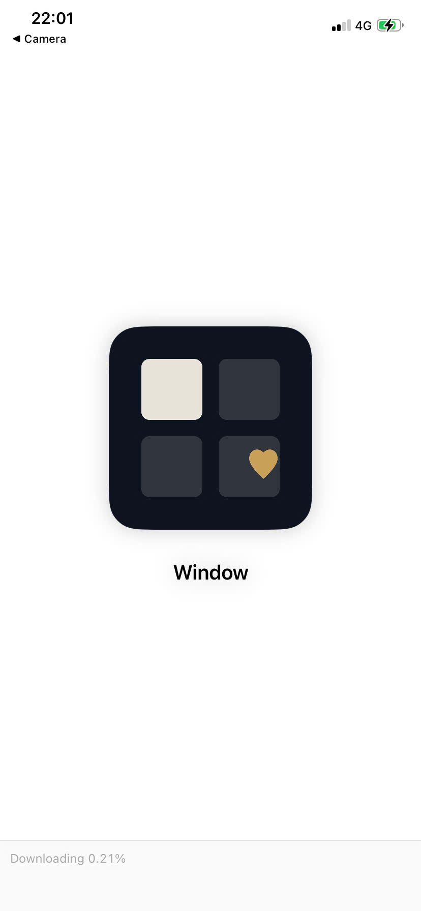
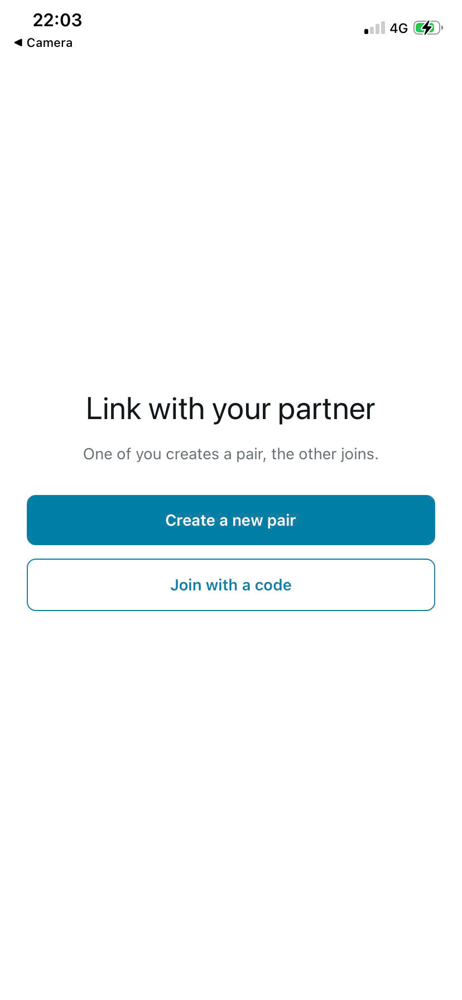
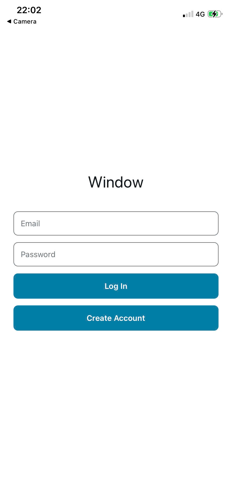
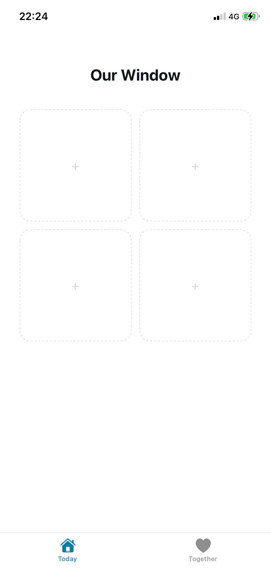
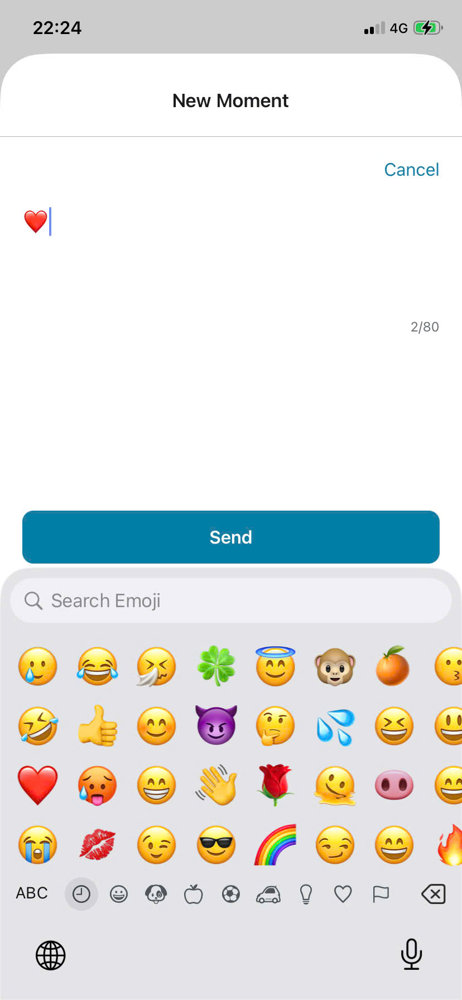
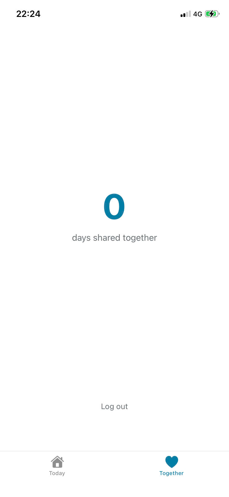

# Window


A minimalist app for exactly two people to share one small moment of their day.

Built for couples — especially long-distance ones — who want a little more to talk about when they call, not another chat app to check.

## Philosophy

**Less is more.** Window deliberately does _not_ have:

- Photos
- Chat or messaging
- Likes or comments
- Online status or typing indicators
- Moment history / scrollback
- Streaks

The goal isn't to replace how you already talk to each other. It's to give you something small to bring into the conversation.

## How it works

- Each app is paired to exactly one other person, using a one-time pairing code.
- Every day, both partners share into **Today's Window** — a shared grid of 4 slots, filled in the order moments are posted. There's no per-person quota; couples naturally balance it out.
- Once all 4 slots are filled, the window closes for the day. No more posting until tomorrow — a small, intentional bit of friction to keep moments meaningful instead of habitual.
- The **Together** tab shows a simple cumulative count: the number of days both partners have shared at least one moment. Not a streak — missing a day costs nothing, so there's no pressure or guilt.
- "Today" is anchored to a fixed timezone (`Asia/Ho_Chi_Minh`) so both partners share the same day boundary, regardless of where either of them actually is.

## Tech stack

- **Frontend:** React Native via Expo (SDK 54)
- **Backend:** Firebase — Firestore for data and realtime sync, Auth for accounts
- No Firebase Storage — there are no photos to store

### Data model

```
users/{uid}
  email, coupleId

couples/{coupleId}
  members, createdAt, sharedDaysCount

couples/{coupleId}/scoredDays/{day}
  scoredAt          // idempotency marker for the shared-days counter

pairingCodes/{code}
  createdBy         // deleted once used

moments/{momentId}
  coupleId, authorUid, text, createdAt, day   // day: "YYYY-MM-DD"
```

### Notable implementation details

- **Race-safe counter:** the cumulative shared-days count is updated inside a Firestore transaction, guarded by a `scoredDays/{day}` marker, so two partners posting at nearly the same moment can't double-count a day.
- **Cross-platform auth persistence:** `getReactNativePersistence` doesn't exist on web, so `firebaseConfig.js` branches on `Platform.OS` — native uses `initializeAuth` + AsyncStorage, web uses plain `getAuth`.
- **Android keyboard fix:** the compose screen's send button used to get hidden behind the keyboard on Android; fixed via `softwareKeyboardLayoutMode: "resize"` in `app.json`.

## Features

- [x] Pairing flow (generate / join code)
- [x] Today's Window — shared 4-slot daily grid
- [x] Compose a moment (text + emoji, 80-character limit)
- [x] Realtime sync between partners
- [x] Cumulative shared-days count (Together tab)
- [x] Dark mode
- [x] Log out
- [x] Android build (EAS Build, internal APK)
- [ ] iOS build (blocked on a paid Apple Developer account)
- [ ] App Store / Google Play release

## Getting started

```bash
git clone https://github.com/khoahdinh/window-app.git
cd window-app
npm install
npx expo start --tunnel
```

You'll need your own Firebase project (Firestore + Auth enabled) and a `firebaseConfig.js` with your project's credentials. Tunnel mode is required for local development due to router client isolation.

## Why this project

The idea came from a friend's story: when he talks with his girlfriend, who lives far away, a big chunk of every call goes into just catching each other up before they can get to an actual conversation — "so what did you do today," "nothing much, just...". Window is meant to skip that part. If the small stuff is already shared by the time you call, you can go straight to the parts worth actually talking about.

It's also a portfolio project built to cover ground that earlier projects didn't: mobile development and a cloud/realtime backend.

## Screenshots

<p align="center">

  
  
  
  
  
</p>

Other projects by the same author ([@khoahdinh](https://github.com/khoahdinh)):

- [`c-learning`](https://github.com/khoahdinh/c-learning) — C++ exercises
- [`nose-water-station`](https://github.com/khoahdinh/nose-water-station) — a full-stack PHP blog
- [`in-the-mood-for-study`](https://github.com/khoahdinh/in-the-mood-for-study) — an Electron Pomodoro + music player app

## License

MIT
